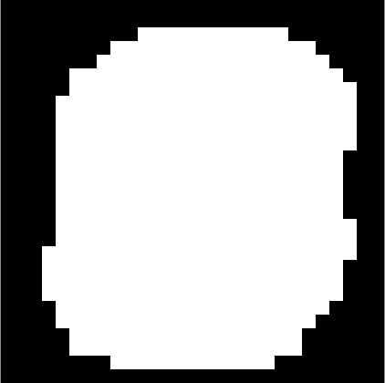
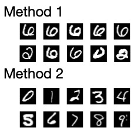

GoDoc: https://godoc.org/github.com/malaschitz/randomForest

Test:

```go
go test ./... -cover -coverpkg=.
```

# randomForest

[Random Forest](https://en.wikipedia.org/wiki/Random_forest) implementation in golang.

## Simple Random Forest

```go
	xData := [][]float64{}
	yData := []int{}
	for i := 0; i < 1000; i++ {
		x := []float64{rand.Float64(), rand.Float64(), rand.Float64(), rand.Float64()}
		y := int(x[0] + x[1] + x[2] + x[3])
		xData = append(xData, x)
		yData = append(yData, y)
	}
	forest := randomForest.Forest{}
	forest.Data = randomforest.ForestData{X: xData, Class: yData}
	forest.Train(1000)
	//test
	fmt.Println("Vote", forest.Vote([]float64{0.1, 0.1, 0.1, 0.1}))
	fmt.Println("Vote", forest.Vote([]float64{0.9, 0.9, 0.9, 0.9}))
```

## Extremely Randomized Trees

```go
	forest.TrainX(1000)
```

## Deep Forest

Deep forest inspired by https://arxiv.org/abs/1705.07366

```go
    dForest := forest.BuildDeepForest()
    dForest.Train(20, 100, 1000) //20 small forest with 100 trees help to build deep forest with 1000 trees
```

## Continuos Random Forest

Continuos Random Forest for data where are still new and new data (forex, wheather, user logs, ...). New data create a new trees and oldest trees are removed.

```go
forest := randomForest.Forest{}
data := []float64{rand.Float64(), rand.Float64()}
res := 1; //result
forest.AddDataRow(data, res, 1000, 10, 2000)
// AddDataRow : add new row, trim oldest row if there is more than 1000 rows, calculate a new 10 trees, but remove oldest trees if there is more than 2000 trees.
```

# Boruta Algorithm for feature selection

Boruta algorithm was developed as package for language R.
It is one of most effective feature selection algorithm.
There is [paper](https://www.jstatsoft.org/article/view/v036i11) in Journal of Statistical Software.

Boruta algorithm use random forest for selection important features.

```go
	xData := ... //data
	yData := ... //labels
	selectedFeatures := randomforest.BorutaDefault(xData, yData)
	// or randomforest.BorutaDefault(xData, yData, 100, 20, 0.05, true, true)
```

In _/examples_ is example with [MNIST database](https://en.wikipedia.org/wiki/MNIST_database).
On picture are selected features (495 from 784) from images.



# Isolation Forest

Isolation forest is an anomaly detection algorithm.
It detects anomalies using isolation (how far a data point is to the rest of the data), rather than modelling the normal points. (wiki)

Two Isolation Forest methods are implemented.
The first is done as a statistic over the standard Random Forest.
After the Random Forest is computed, per tree and per branch it calculates how deep each record is.
This is done over all trees, and the function returns the ranked statistics of the individual records.
I recommend increasing the MaxDepth value.

```go
	isolations, mean, stddev := forest.IsolationForest()
	for i, d := range isolations {
		fmt.Println(i, d, mean, stddev)
	}
```

The second method is done by https://en.wikipedia.org/wiki/Isolation_forest.
It gives different results than the first one.
In the isolation2.go example, it is used in a way that each label is evaluated separately.

```go
	forest := randomforest.IsolationForest{X: x}
	forest.Train(TREES)
```

Result for MINST are on image.


